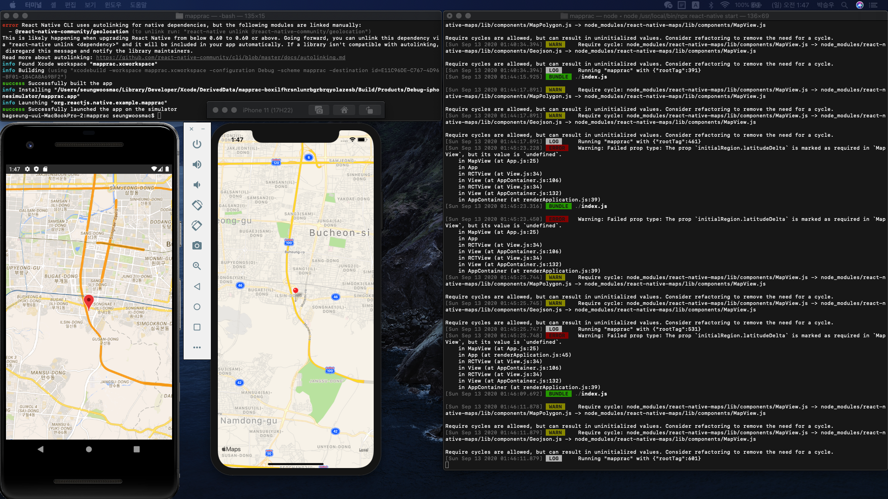

react-native-maps usage
===================

## Execution screen 
  
  
-----------------------

## How to use
> ### Source
> react-native-maps: <https://github.com/react-native-community/react-native-maps>

> ### **ios**
> - First, install react-native-maps
> ```bash
>   npm install --save react-native-maps
> ```
> - Second, Move dir to ~project/ios and run pod install
> ```bash
>   # in project dir
> 
>   cd ios
>   pod install
>   cd ..
> ```
> - Third, use MapView
> ```javascript
>   import MapView from 'react-native-maps';
>   ...
>   <MapView />
>   ...
> ```

> ### **android**
> - First, 
